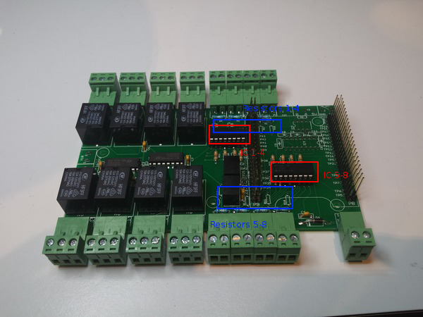

# Osso inputs: opto or non-opto insulated digital inputs.

Osso come with the ability to change digital inputs to optoinsulated or non optoinsulated.

Which one you need to use depend on what you really need:

If you want to have a simple "open close" circuit, with a clean contact like a simple push button, and you don't have interference issues or very long ( > 50 meters ) wiring for inputs, non-opto insulated it's the way to go.

If you need to push current to the inputs, opto-insulated is your right choice, so, you can put from 2 to 24V DC voltage on the digital inputs.

Switch from one to another on Osso is easy: you just need to swap some IC, and in the last case to solder 8 resistors.

Inputs on Osso are organized in groups of 4: from 1 to 4 and from 5 to 8. Different groups can be used in different modes.

With Osso we provide also a couple of ICs, so, you don't need any other spare component.

We provide: 

* 2x DIP16 TLP521-4x opto-decoupler 
* 2x 4116-R LF resistors array

By default, if nor otherwise requested, we mount on Osso the array resistors for non-opto isolated inputs.

## Opto-insulated configuration
Uses TLP521-4x ICs in the two dip16 sockets as on the image, no resistors are needed. You will need to put 2 to 24 Volts on the input to change input status ( resistors on inputs are for max 250mW! )

## Non-opto insulated configuration
Uses 4116R-LF ICs in the two dip16 sockets as on the image, no resistors are needed. It will change input status on short.
