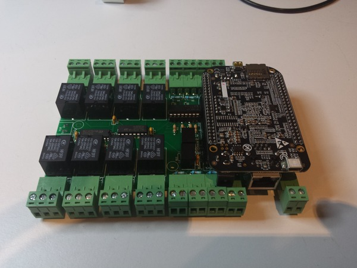
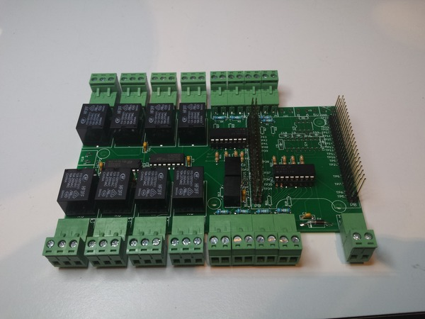
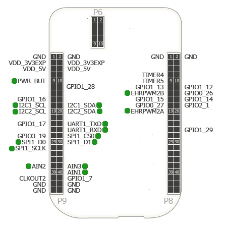

Osso
====

Osso Beaglebone (white/black/green) I/O cape board support files

Osso is a Beaglebone (white/black/green) expansion cape with 8 digital optoinsulated inputs and 8 relays 275VAC@10A.

Osso is shipped with the ability to switch optoinsulated inputs or non-optoinsulated inputs, to better fit user needs.

Docs about how to change input types: https://git.nexlab.net/nexlab/Osso/wikis/Osso-Inputs

The expansion cape has to be powered by a 12VDC connector (9 to 24VDC supported), and it will power the Beagleboard from expansion pins ( no need to give external power from USB or power connector on the beaglebone! )

The size of the cape is a standard format for 9 units DIN mount boxes.

Test Debian GNU/Linux install available: take a look at [TEST.md]

For more infos: https://www.nexlab.net/

Do you like our cape? Donations in Bitcoin is accepted at 1FfyqV2SnrhM5sTwL9jUCt2qPDgCPnwggi

Pin diagram (green dot pins are optional, other required):

